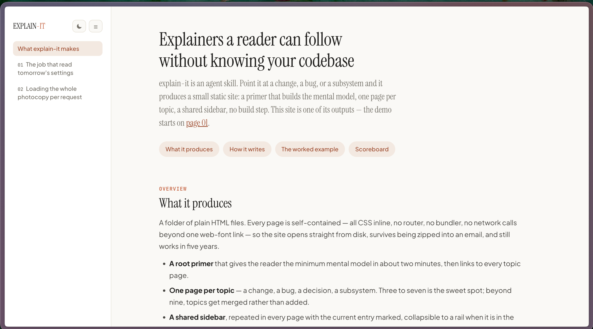

# explain-it

An [Agent Skill](https://agentskills.io) that turns code — a PR, a bug, a
subsystem — into a small, beautiful, **beginner-calibrated HTML explainer
site**: a root primer page that builds the mental model, one page per topic,
and a shared sidebar connecting them. Light and dark themes, self-contained (works
straight from `file://`), no build step.



Born from a real workflow: after a dense kernel PR review, the maintainer
asked for the findings "explained like I have no context of this." The
result — runtime stories, metaphor-driven primers, red/green crux diffs,
quantified cost callouts, and an honest applied-vs-proposed scoreboard —
hit exactly the right register: *"simple language that is not too simple
and not too difficult."* This skill captures that method so it works on any
codebase and any agent.

## What you get

- **A primer page** — the 2-minute mental model, with one consistent
  metaphor per concept (introduced once, reused verbatim).
- **Topic pages** — each opens with "When does this code even run?" actor
  stories, then quantified problem callouts, then trimmed diff blocks whose
  inline comments explain *why*, not *what*.
- **A sidebar on every page**, plain relative links, current page
  highlighted — the whole site reads like one document.
- **A scoreboard** — what's merged, what's proposed, what's parked, and
  where each lives in the codebase.

## Install

With the [skills CLI](https://github.com/vercel-labs/skills) (installs into
Claude Code, Codex, Cursor, and ~70 other agents):

```bash
npx skills add <owner>/<repo> --skill explain-it
```

Or manually: copy this folder into your agent's skills directory
(`~/.claude/skills/explain-it`, `.agents/skills/explain-it`, …).

## Use

Ask your agent things like:

> "Explain this PR in simple terms — I have no context of this code."
> "Create an explainer site for the auth subsystem for new hires."
> "Turn these review findings into a walkthrough my cofounder can read."

The agent investigates the actual code first (never explains unverified
claims), plans the pages, and builds the site from the bundled template.

## Layout

```
explain-it/
├── SKILL.md                      # agent instructions (the workflow)
├── references/
│   ├── writing-guide.md          # the calibration method — the heart of the skill
│   ├── design-system.md          # tokens + component rules
│   └── site-template.html        # working page skeleton with every component
├── README.md                     # this file (for humans)
└── LICENSE.txt                   # MIT
```

## License

MIT — see [LICENSE.txt](LICENSE.txt).
